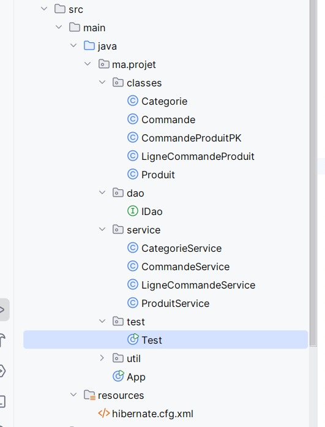
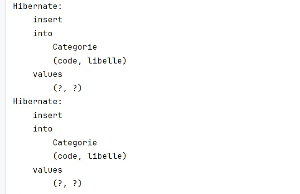
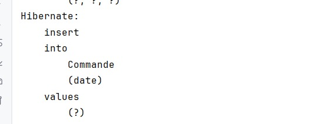
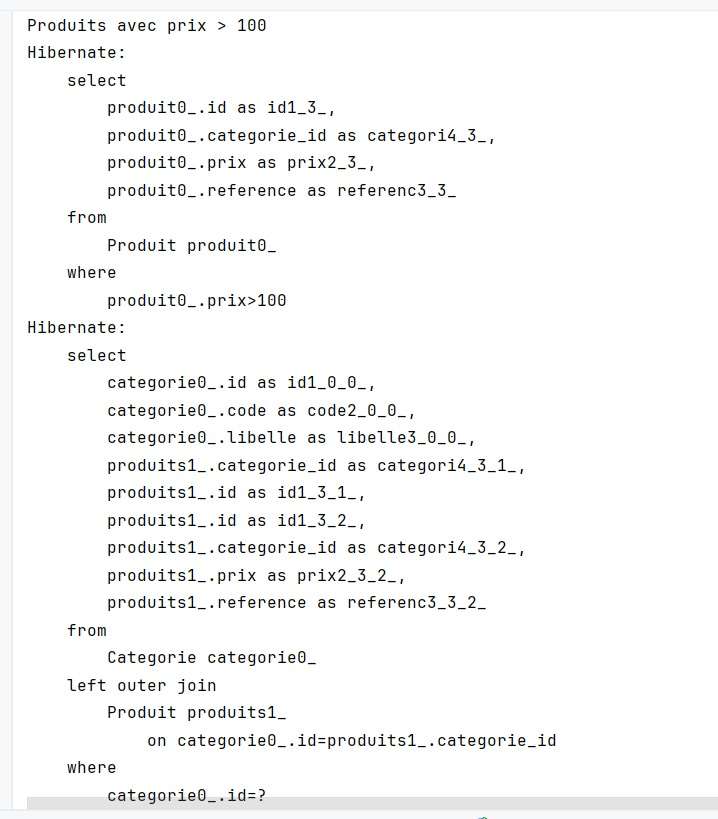
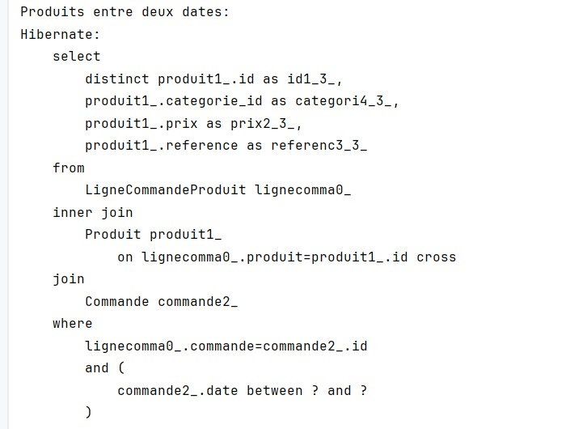

# Stock Hibernate – TP Gestion de Stock
## Description

Ce projet est un TP d’évaluation réalisé en Java avec Hibernate et Maven.

Il s’agit d’une application de gestion de stock permettant de :

- Gérer les Catégories

- Gérer les Produits

- Gérer les Commandes

- Gérer les Lignes de Commande

- Manipuler une base de données via Hibernate (ORM)

## L’architecture du projet respecte une organisation en couches :

classes → Entités JPA

dao → Interface DAO

service → Logique métier

util → Configuration Hibernate

test → Classe de test principale

## Technologies utilisées

Java

Hibernate

Maven

MySQL 

## Structure du projet
stock_hibernate/

## Configuration
### Base de données

Configurer les informations de connexion dans :

src/main/resources/hibernate.cfg.xml

Modifier :

URL

Username

Password

Dialect

Exemple :

<property name="hibernate.connection.url">jdbc:mysql://localhost:3306/stock_db</property>
<property name="hibernate.connection.username">root</property>
<property name="hibernate.connection.password">1234</property>

## Fonctionnalités testées

Dans la classe Test.java, on retrouve :

## Ajout de catégories

## Ajout de produits

## Création de commandes

## Affichage des données

