# Stock Hibernate – TP Gestion de Stock
## Description

Ce projet est un TP d’évaluation réalisé en Java avec Hibernate et Maven.

Il s’agit d’une application de gestion de stock permettant de :

- Gérer les Catégories

- Gérer les Produits

- Gérer les Commandes

- Gérer les Lignes de Commande

- Manipuler une base de données via Hibernate (ORM)

## L’architecture du projet respecte une organisation en couches :

classes → Entités JPA

dao → Interface DAO

service → Logique métier

util → Configuration Hibernate

test → Classe de test principale

## Technologies utilisées

Java

Hibernate

Maven

MySQL 

## Structure du projet
stock_hibernate/

## Configuration
### Base de données

Configurer les informations de connexion dans :

src/main/resources/hibernate.cfg.xml

Modifier :

URL

Username

Password

Dialect

Exemple :

<property name="hibernate.connection.url">jdbc:mysql://localhost:3306/stock_db</property>
<property name="hibernate.connection.username">root</property>
<property name="hibernate.connection.password">1234</property>

## Fonctionnalités testées

Dans la classe Test.java, on retrouve :

## Ajout de catégories

## Ajout de produits

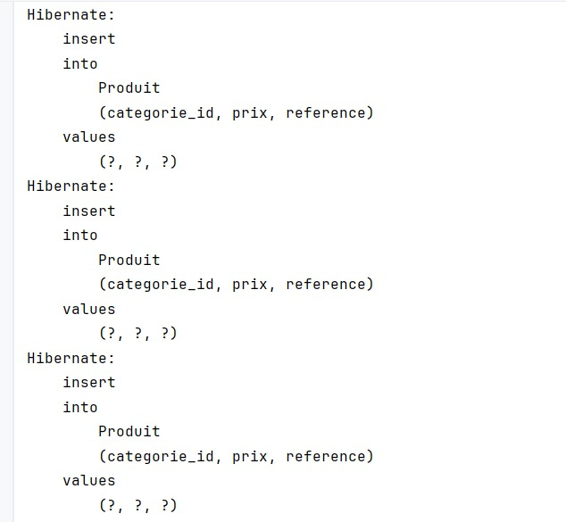

## Création de commandes

## Affichage des données

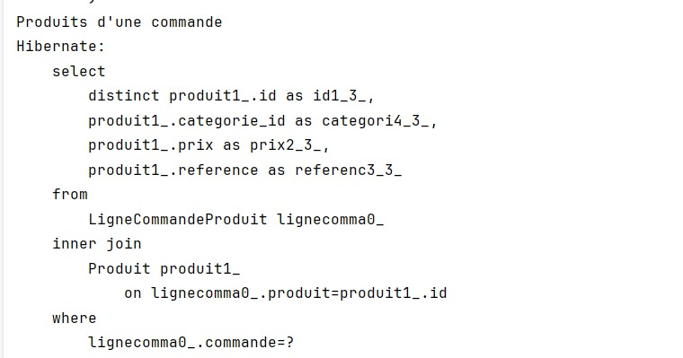

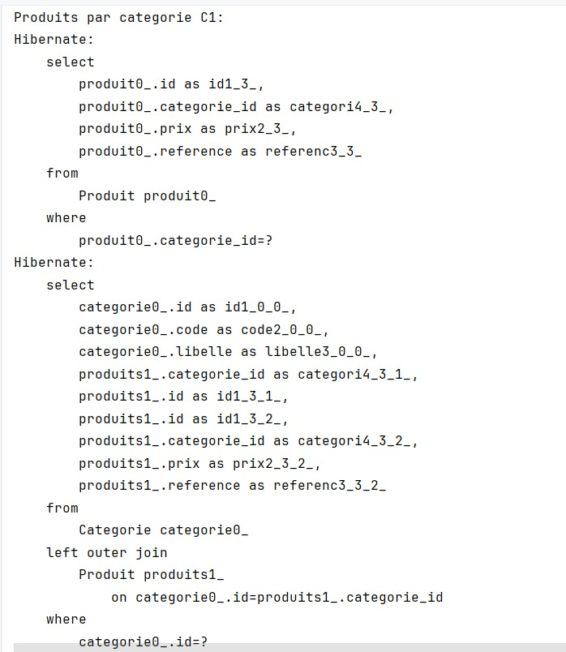

-----------------------------------------------------------------------------------------------------------

# Gestion des projets - Java / Hibernate / MySQL

## Description
Ce projet est une application Java développée avec Maven, Hibernate et MySQL pour gérer :

- les employés,
- les projets,
- les tâches,
- et les tâches réalisées par les employés.

L’objectif est de manipuler les relations entre ces entités et d’exécuter des requêtes métiers, notamment :

- afficher les tâches dont le prix est supérieur à 1000 DH,
- afficher les tâches réalisées entre deux dates.

---

## Technologies utilisées

- Java
- Maven
- Hibernate
- JPA
- MySQL

---

## Structure du projet

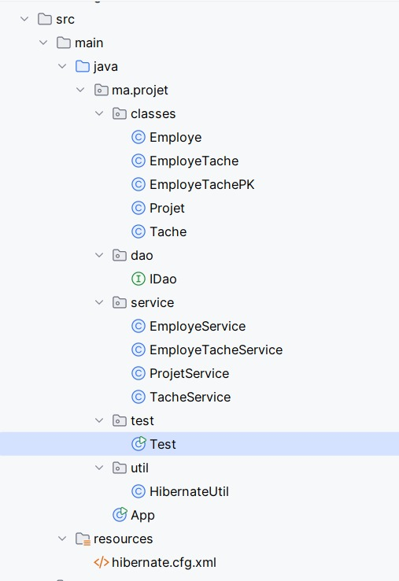

## crée un employé

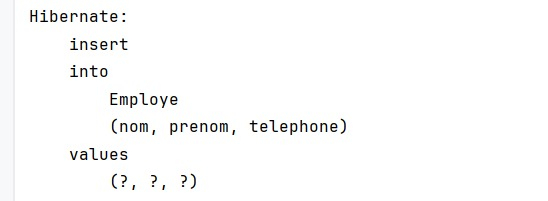

## crée un projet

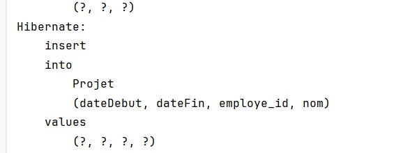

## crée deux tâches

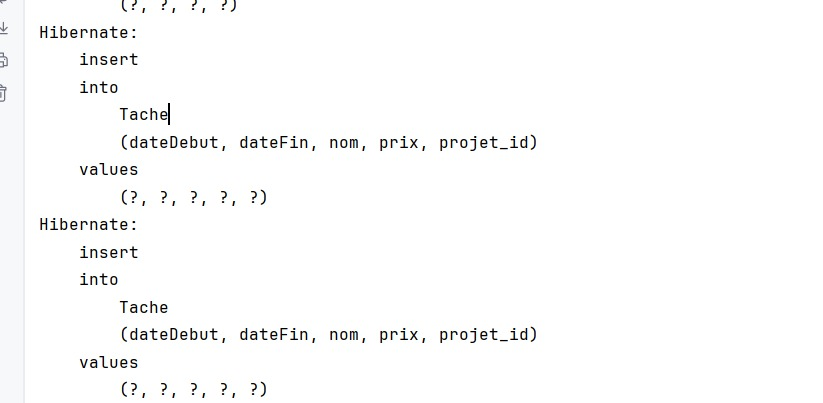

## affecte une tâche réalisée à un employé

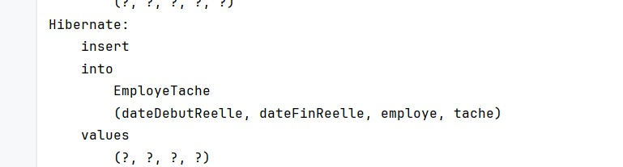

## exécute les deux requêtes demandées

- ### Afficher les tâches dont le prix est supérieur à 1000
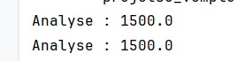

- ### Afficher les tâches réalisées entre deux dates

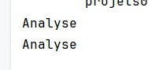

---------------------------------------------------------------------------------------------------------------------

# Gestion État Civil - Hibernate + MySQL

Application Java développée avec **Hibernate (JPA)** et **MySQL** permettant de gérer :

-  Hommes
-  Femmes
-  Mariages (avec dates et nombre d’enfants)

Le projet démontre l’utilisation de :
- HQL
- NamedQuery
- Named Native Query
- Criteria API
- Héritage JPA

---

#  Technologies utilisées

- Java 8+
- Maven
- Hibernate ORM
- MySQL
- JPA Annotations

---

insère des données

exécute toutes les requêtes demandées

affiche les résultats dans la console

## Structure du projet

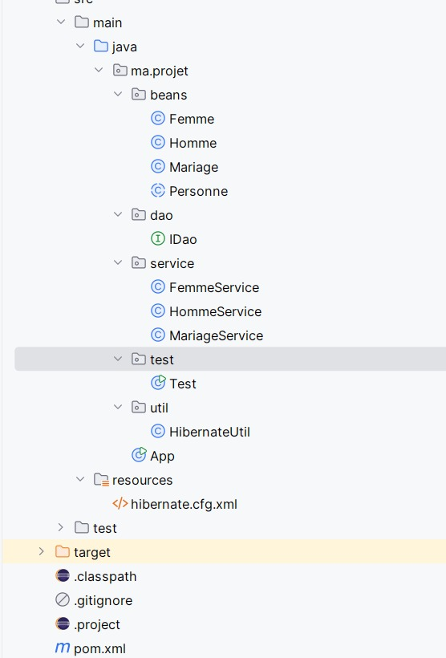

 ## Tables générées automatiquement

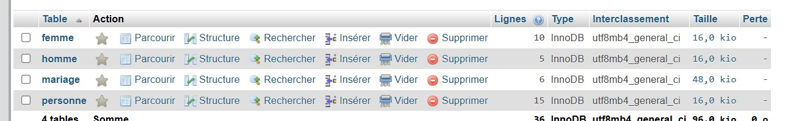

## Sortie affichée :

 ### Liste des femmes :

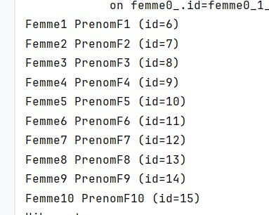

### Femme la plus âgée

### La femme la plus âgée est :

  ### Épouses entre deux dates
  

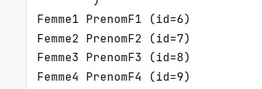

### Nombre d’enfants :

### Femmes mariées au moins 2 fois :

### Nombre d'hommes mariés à 4 femmes :

### Mariages de l'homme :

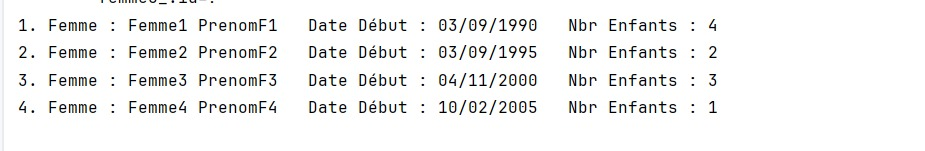

